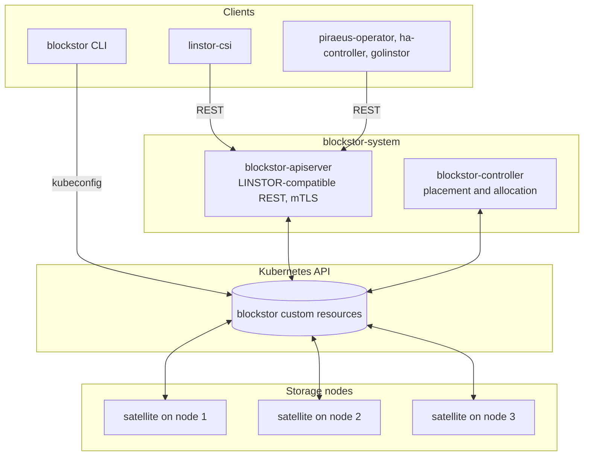
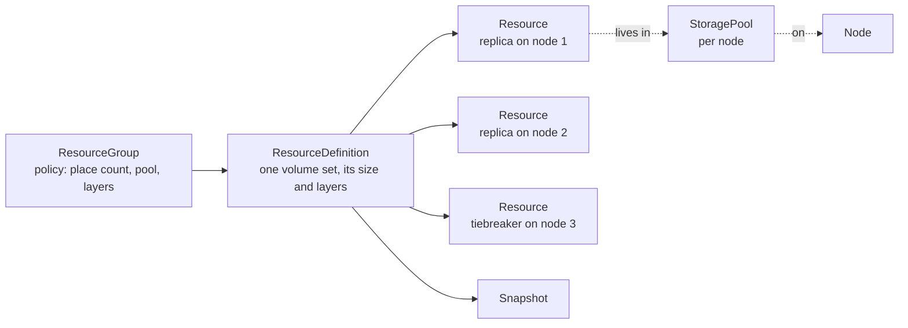
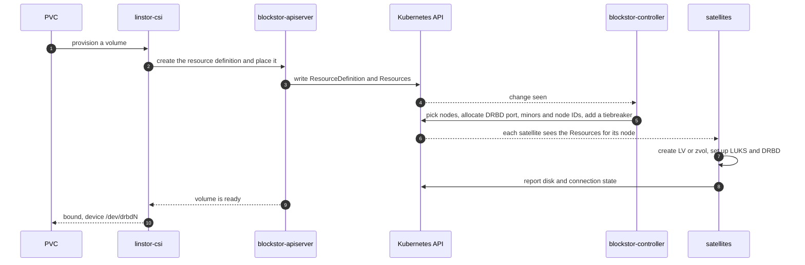
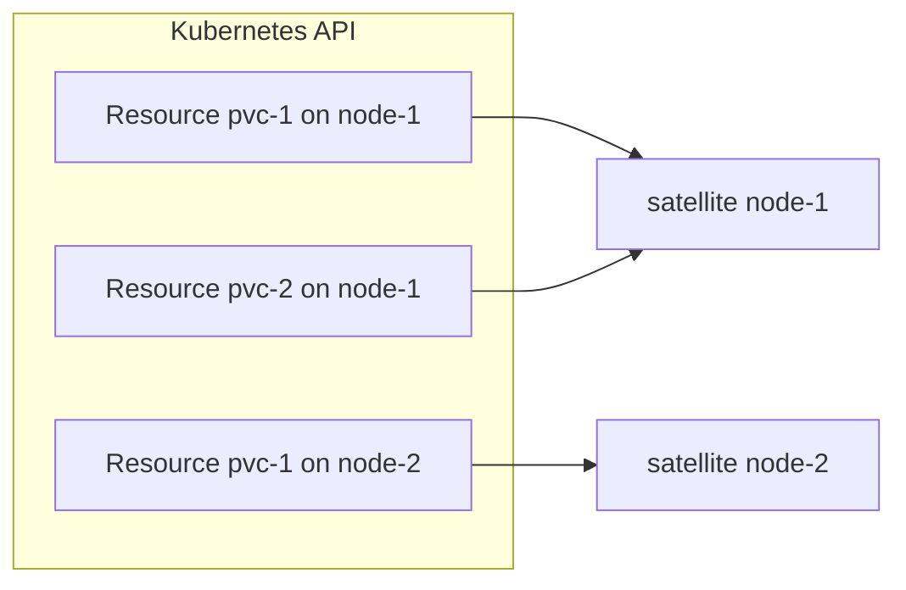
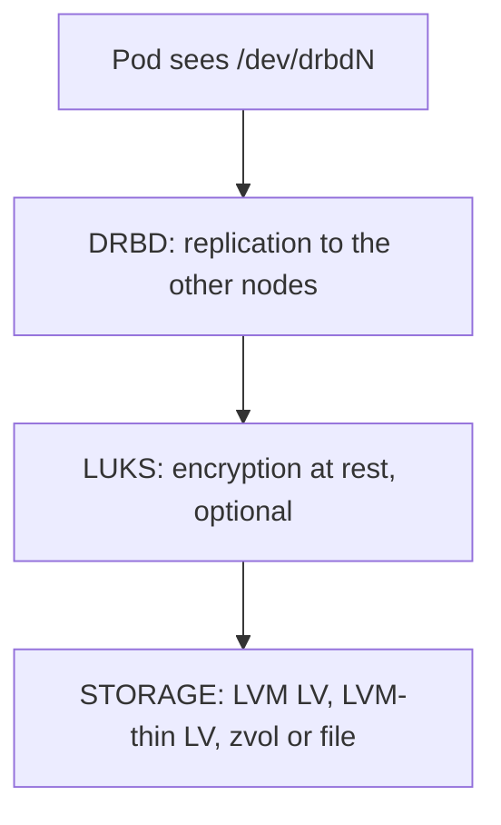

Blockstor is built like a Kubernetes operator. The desired state of every node, pool and volume is a custom resource, and controllers keep working until the cluster matches it. Nothing important lives only in a process's memory, so any blockstor pod can restart without losing state.

## Components

- **blockstor-apiserver** serves the LINSTOR REST API over mutual TLS. It does not keep state of its own: every request becomes a read or a write of custom resources. It runs as several replicas behind one Service.
- **blockstor-controller** watches the custom resources and fills in what users do not choose: which nodes get replicas, the DRBD port, minor numbers and node IDs, and tiebreakers and quorum settings.
- **blockstor-satellite** runs on every storage node. It creates the logical volumes or zvols, sets up LUKS and DRBD, and reports what it sees back into the custom resources.
- **The `blockstor` CLI** reads and writes the custom resources directly with your kubeconfig, without going through the REST API.

There is no direct connection between the controller and the satellites. Everything goes through the Kubernetes API.

## Custom resources are the source of truth

Every object you know from LINSTOR is a cluster-scoped custom resource in the `blockstor.cozystack.io` group:

Each resource has two halves:

- **spec** is what you, the controller or the API asked for.
- **status** is what the satellites observed: disk states, connection states, free capacity.

A satellite never changes a spec, and the API never writes a status. Because the state is ordinary Kubernetes objects, you can read it with `kubectl get resources`, back it up with your usual tools, and drive it from GitOps.

## How a volume is created

This is the path from a PersistentVolumeClaim to replicas on disk:

## Each satellite watches only its own node

A satellite reacts only to the resources assigned to its node: replicas and pools whose node name is its own. Adding nodes adds satellites, and none of them has to talk to a central process.

## Layers on a node

Every replica is a stack of layers. The satellite builds it from the bottom up when it creates a replica and takes it apart from the top down when it removes one.

The default stack is DRBD on top of STORAGE. See [Layer stack](../layer-stack/) for the other combinations.

## Replicas, tiebreakers and quorum

With an even number of data replicas, the controller adds a diskless tiebreaker on another node, so DRBD always has a majority to decide which side keeps writing after a network split. A replica without a disk can also serve I/O over the network to a pod on a node that holds no copy of the data.
