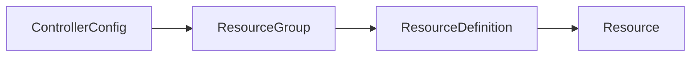

Everything blockstor manages is a cluster-scoped custom resource in the `blockstor.cozystack.io/v1alpha1` API group. You can create and change them with `kubectl` or GitOps, with the [`blockstor` CLI](../cli/), or through the REST API. All three edit the same objects.

| Kind | What it describes | Name |
|---|---|---|
| `Node` | A storage node and its replication address | the Kubernetes node name |
| `StoragePool` | A pool of space on one node | `<pool>.<node>` |
| `PhysicalDevice` | A raw disk the satellite found on a node | set by the satellite |
| `ResourceGroup` | A placement and replication policy | any |
| `ResourceDefinition` | One volume set: sizes, layers, policy | any |
| `Resource` | One replica of a definition on one node | `<definition>.<node>` |
| `Snapshot` | A snapshot of a definition | `<definition>.<snapshot>` |
| `ControllerConfig` | Cluster-wide settings | always `default` |

The naming rules are enforced by the API server, so a `Resource` or `StoragePool` with a name that does not match its spec is refused. Each kind has printer columns, so `kubectl get resources` or `kubectl get storagepools` gives a useful table.

Most objects have a `spec` you write and a `status` that blockstor writes. The examples below show only `spec`.

## Node

A node that runs the satellite. The address of the first network interface is the one DRBD uses for replication.

```yaml
apiVersion: blockstor.cozystack.io/v1alpha1
kind: Node
metadata:
  name: worker-1
spec:
  type: SATELLITE
  netInterfaces:
    - name: default
      address: 10.0.0.11
```

## StoragePool

Space for replicas on one node. The provider decides how volumes are allocated, and the properties name the backing volume group, thin pool, ZFS pool or directory.

```yaml
apiVersion: blockstor.cozystack.io/v1alpha1
kind: StoragePool
metadata:
  name: data.worker-1
spec:
  nodeName: worker-1
  poolName: data
  providerKind: LVM_THIN
  props:
    StorDriver/LvmVg: my_vg
    StorDriver/ThinPool: my_thinpool
```

For a ZFS thin pool:

```yaml
apiVersion: blockstor.cozystack.io/v1alpha1
kind: StoragePool
metadata:
  name: zfs-data.worker-1
spec:
  nodeName: worker-1
  poolName: zfs-data
  providerKind: ZFS_THIN
  props:
    StorDriver/ZPoolThin: tank
```

The providers are `LVM`, `LVM_THIN`, `ZFS`, `ZFS_THIN`, `FILE`, `FILE_THIN` and `DISKLESS`. Pools with the same name on different nodes form one pool from the placement point of view: a policy that says "pool `data`" can place replicas on every node that has a `data` pool.

## PhysicalDevice

The satellites report the raw disks they find as `PhysicalDevice` objects, with their size, model and path in `status`. To build a pool from one, set `attachTo`:

```yaml
apiVersion: blockstor.cozystack.io/v1alpha1
kind: PhysicalDevice
metadata:
  name: <name the satellite gave it>
spec:
  attachTo:
    storagePoolName: data
    providerKind: ZFS_THIN
    zPoolName: data
```

The CLI does the same thing with `blockstor physical-storage create-device-pool`.

## ResourceGroup

A policy that volumes inherit: how many replicas, in which pool, with which layers, and with which DRBD options.

```yaml
apiVersion: blockstor.cozystack.io/v1alpha1
kind: ResourceGroup
metadata:
  name: replicated
spec:
  description: Two data replicas plus a tiebreaker
  selectFilter:
    placeCount: 2
    storagePool: data
    layerStack: ["DRBD", "STORAGE"]
    replicasOnDifferent: ["Aux/topology.kubernetes.io/zone"]
  drbdOptions:
    resource:
      quorum: majority
      onNoQuorum: suspend-io
  volumeGroups:
    - volumeNumber: 0
```

Placement constraints match node properties. Blockstor copies the Kubernetes node labels under `topology.kubernetes.io/` and `node-role.kubernetes.io/`, and `kubernetes.io/hostname`, onto each `Node` as `Aux/<label>` properties, so the example above spreads replicas across zones.

`selectFilter` also takes `nodeNameList` to pin replicas to named nodes, `replicasOnSame` to keep them together by a node property, and `storagePoolList` to allow several pools.

## ResourceDefinition

One volume set. Its volumes are listed in `volumeDefinitions`, sized in KiB. Settings it does not carry are inherited from its resource group.

```yaml
apiVersion: blockstor.cozystack.io/v1alpha1
kind: ResourceDefinition
metadata:
  name: my-volume
spec:
  resourceGroupName: replicated
  volumeDefinitions:
    - volumeNumber: 0
      sizeKib: 10485760   # 10 GiB
```

The controller fills in the DRBD port and the per-volume minor numbers. Once set they cannot change, because changing them would disconnect the replicas.

## Resource

One replica of a definition on one node. Usually the controller creates these when it places a volume, but you can also place a replica by hand:

```yaml
apiVersion: blockstor.cozystack.io/v1alpha1
kind: Resource
metadata:
  name: my-volume.worker-3
spec:
  resourceDefinitionName: my-volume
  nodeName: worker-3
  storagePool: data
```

A replica with the `DISKLESS` flag holds no data and reaches the volume over the network. The controller adds tiebreakers as diskless replicas with the `TIE_BREAKER` flag. Its `status` shows the DRBD state of every volume on that node.

## Snapshot

A point-in-time snapshot of a definition, taken on the nodes listed in `nodes`, or on every node with a replica if the list is empty:

```yaml
apiVersion: blockstor.cozystack.io/v1alpha1
kind: Snapshot
metadata:
  name: my-volume.before-upgrade
spec:
  resourceDefinitionName: my-volume
  snapshotName: before-upgrade
```

Restore it as a new volume with `blockstor snapshot resource-definition restore`, see [Using the CLI](../cli/#snapshots).

## ControllerConfig

Cluster-wide settings. Only the object named `default` is read. DRBD options here are the defaults for every group, definition and replica.

```yaml
apiVersion: blockstor.cozystack.io/v1alpha1
kind: ControllerConfig
metadata:
  name: default
spec:
  drbdOptions:
    net:
      protocol: C
  passphraseSecretRef:
    name: blockstor-cluster-passphrase
```

`passphraseSecretRef` names the Secret in `blockstor-system` that holds the cluster passphrase for LUKS under the key `passphrase`. Without a ControllerConfig, blockstor looks for a Secret named `blockstor-cluster-passphrase`.

## How settings are inherited

DRBD options and properties are resolved from the broadest scope to the narrowest, and a value set lower down wins:



A value that is set explicitly counts as set even when it is `false` or zero, so a definition can turn off something its group turns on.
